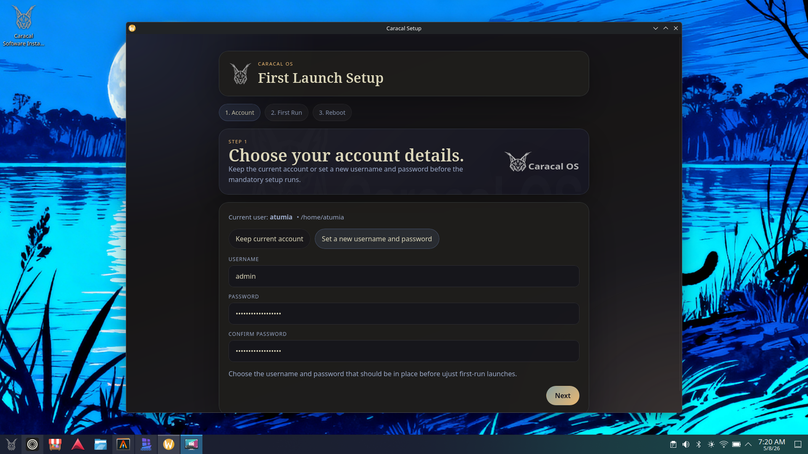

# Caracal Setup



`caracal-setup` is a Wails desktop wizard for the first graphical launch on Caracal OS.

It mirrors the look and static frontend structure of `caracal-software-installer`, but focuses on the mandatory first-run flow:

- optionally set a new username and password
- launch `ujust first-run` in a terminal window
- finish with a reboot action

## Development

```bash
go run ./cmd/caracal-setup-gui
./scripts/wails-dev.sh
./scripts/wails-build.sh
```

The frontend is a static bundle in `frontend/dist`, so `npm run build` only verifies that the generated assets exist.
